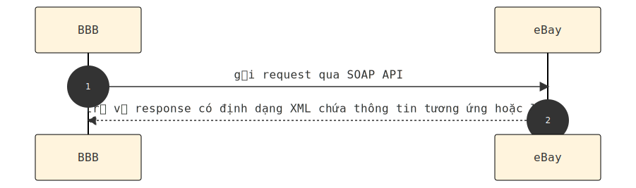
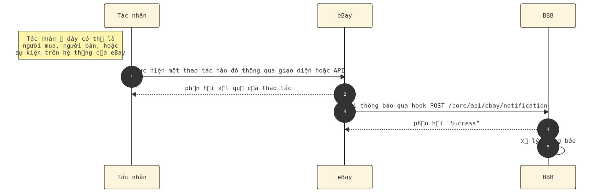
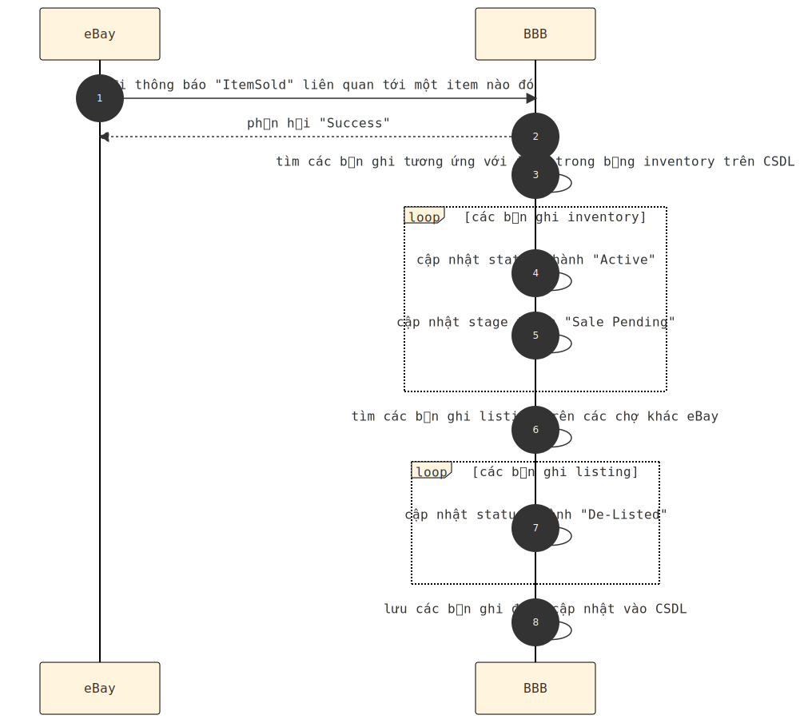
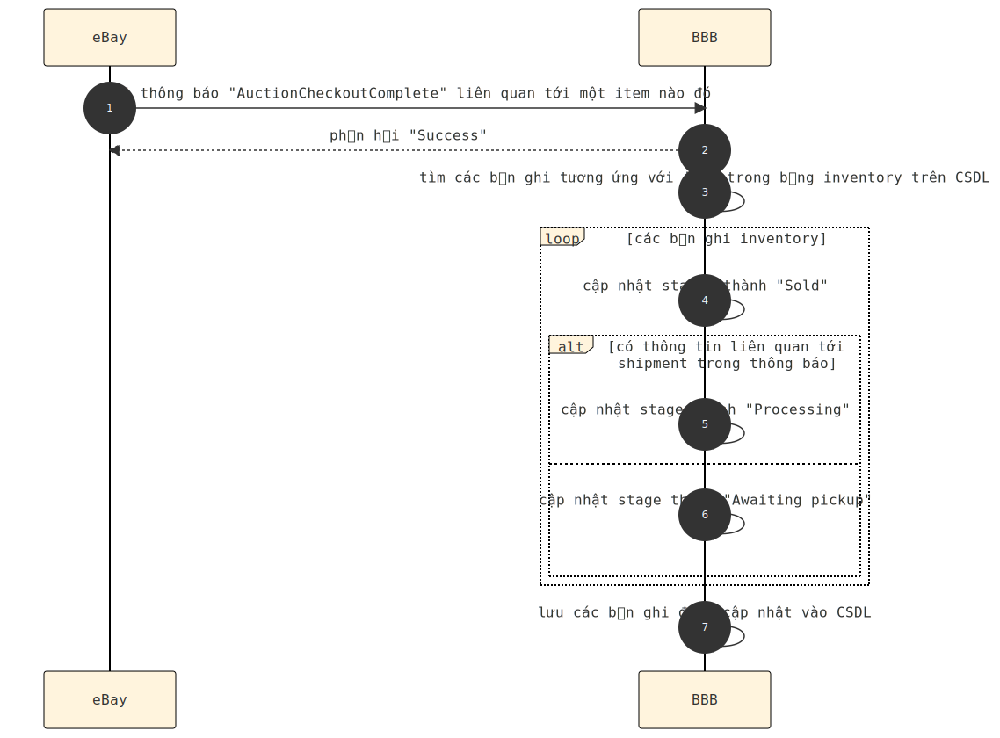
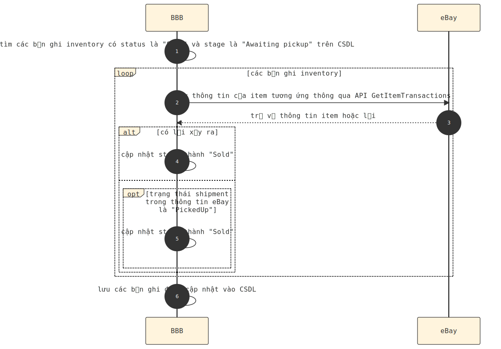
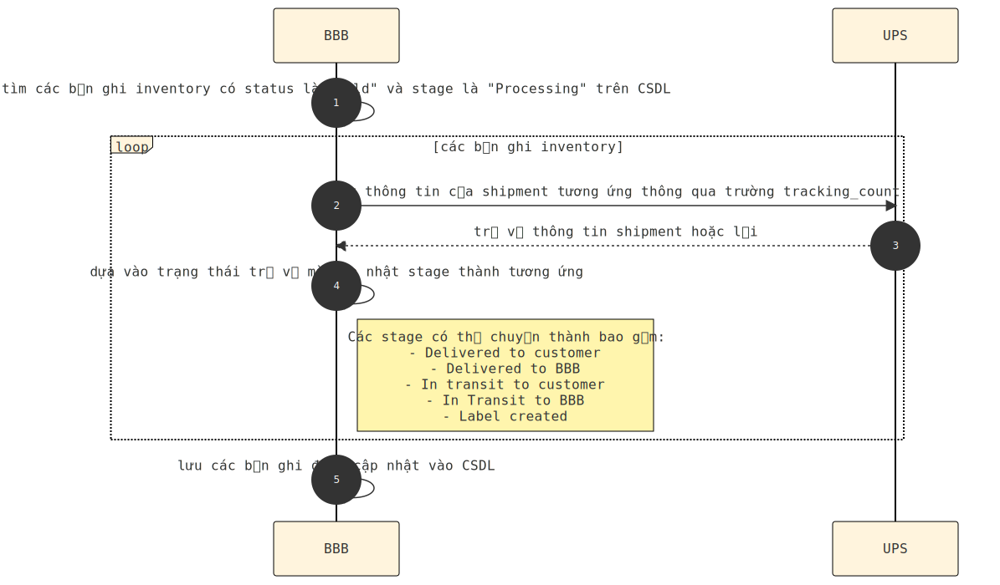
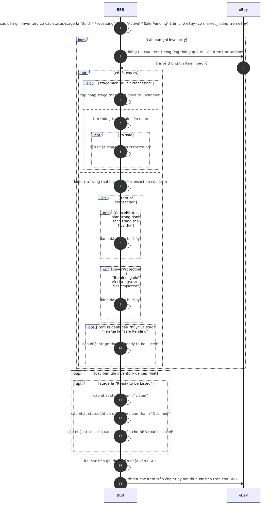

[type=adoc]
:author: Tuanm

:bitbucket: https://bitbucket.org/bicyclebluebook/workspace/projects/BBB
:ebay-api-docs: https://developer.ebay.com/Devzone/XML/docs/Reference/eBay/index.html
:ebay-notification-docs: https://developer.ebay.com/devzone/client-alerts/docs/Concepts/ClientAlertsAPIGuide.html
:ebay-get-item-transactions-docs: https://developer.ebay.com/Devzone/XML/docs/Reference/eBay/GetItemTransactions.html

== Lời tựa
Hiện tại, hệ thống BBB đã tích hợp các tính năng liên quan tới mua bán trên sàn eBay. Với số lượng tính năng không hề ít, nhiều phần đã đi vào hoạt động ổn định hoặc tương đối ổn định được một khoảng thời gian dài (từ năm 2018). Để nắm được những luồng hoạt động này, thành viên mới tham gia dự án BBB cần đọc-hiểu mã nguồn (qua các kho lưu trữ trên {bitbucket}[BitBucket]), đồng thời chủ động trao đổi với các thành viên cũ, v.v., nói chung: rất tốn thời gian và công sức. Chính vì vậy, đội ngũ JAVa của BBB (năm 2023) quyết định tài liệu hoá các tính năng liên quan tới eBay một cách không quá chi tiết, dễ hiểu, và cập nhật liên tục theo các yêu cầu cũng như bản vá (hotfix) mới.

== Nội dung

=== Cơ chế giao tiếp giữa BBB và eBay
Hệ thống BBB gửi dữ liệu lên eBay thông qua các {ebay-api-docs}[SOAP API].

Phía eBay đồng bộ dữ liệu về BBB thông qua REST API: `POST /core/api/ebay/notification` (ta tạm gọi là "bắn thông báo"). Các "thông báo" sẽ được hệ thống BBB xử lý dựa trên các "sự kiện" tương ứng (có thể xem chi tiết tại {ebay-notification-docs}[đây]).

Tuy nhiên, vì một số lý do khách quan, phía BBB không nhận được thông báo từ eBay, một số sự kiện không được xử lý khiến dữ liệu trên hai hệ thống không được nhất quán. Để xử lý vấn đề này, hệ thống BBB triển khai một số job chạy định kỳ để tự động đồng bộ dữ liệu.

=== Thông tin item trên hệ thống eBay
Để lấy thông tin item từ eBay, ta thông qua {ebay-get-item-transactions-docs}[GetItemTransaction]. API này yêu cầu truyền lên `ItemID` (là giá trị của cột `item_id` trong bảng `market_listing`), và trả về thông tin của item tương ứng trên hệ thống eBay. Ta chú ý tới các thuộc tính sau của item:

. `Item.ListingDetails`: chỉ định thời gian một item có mặt trên sàn mua bán của eBay.
. `Item.SellingStatus.ListingStatus`: trạng thái của item hiện tại trên hệ thống eBay.
. `TransactionArray.Transaction.ShippingDetails`: thông tin về vận chuyển liên quan tới đơn hàng của item đó.
. `TransactionArray.Transaction.Status.CheckoutStatus`: thông tin về tình trạng thanh của đơn hàng.
. `TransactionArray.Transaction.ContainingOrder.CancelStatus`: thông tin về tình trạng huỷ của đơn hàng.

=== Cập nhật trạng thái inventory
- Khi nhận được thông báo `ItemSold`, intentory liên quan tới item sẽ được cập nhật status thành `Active` và stage thành `Sale pending`. Ngoài ra, các listing trên các chợ khác (khác eBay) sẽ được cập nhật status thành `De-Listed`.

- Khi nhận được thông báo `AuctionCheckoutComplete`, inventory sẽ được cập nhật status thành `Sold`, và dựa trên thông tin về dịch vụ vận chuyển của đơn hàng, stage của nó sẽ được chuyển thành `Processing` hoặc `Awaiting pickup`.

- Một job bên `core` có tên là `ItemSoldEbayJob` sẽ chạy định kỳ để kiểm tra thông tin item trên eBay, và cập nhật các inventory có stage là `Awaiting pickup` thành `Sold` khi cần thiết.

- Bên `shipment` cũng có một job tên `ScanTrackingStatusJob` để kiểm tra thông tin của các item mà inventory có stage `Processing` trên hệ thống của đơn vị vận chuyển UPS. Dựa vào trạng thái của đơn hàng trên UPS, stage của inventory sẽ được chuyển thành `Delivered to customer` hoặc `Delivered to BBB`.

- Ngoài ra, bên `core` còn có một job `MarketListingEbaySoldJob` để đồng bộ các inventory có status là `Sold`, và stage là `Processing` hoặc `Awaiting pickup` theo thông tin lấy về từ eBay.

