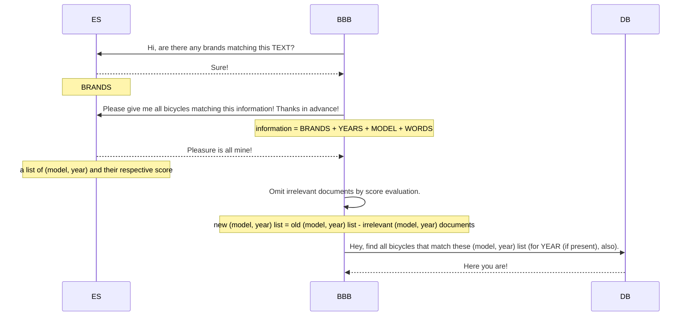

# ElasticSearch integration

## Abbreviation & Terminology

Before jumping in this documentation, we have to understand what is:

|Stuff|Meaning|
|-|-|
|BBB|BicycleBlueBook sites or BicycleBlueBook services|
|ES|ElasticSearch service, in our system, we've been using AWS OpenSearch service as it|
|DB|BicycleBlueBook's relational databases|
|Bicycle|The information of a specific bicycle in BicycleBlueBook system, including stuff helps us differentiate it among others (e.g.: brand, model, year, type, etc.)|
|VG|Value-Guide functionality of BicycleBlueBook site, which helps user evaluate any bicycle in the world|

## Introduction

In regard to user-experience enhancement in searching feature, we have been taking advantages of a bunch of edge-cutting technologies (to be honest, just a few of them) to up-speed the searching process such as using multi-layer caching mechanism, SQL tuning, doing many optimization, and of course, integrating with a reputed tool naming of ElasticSearch. Actually, ES has been already used in many services of ours, presented a crucial part of ELK stack in our logging, tracing, and monitoring systems. In this documentation, we shall focus only on how we have integrated ES in VG searching feature.

## VG

First things first, we should know fundamental things about our VG feature. The VG site is now locating at [this address][vg-site], users can access it via clicking on "Value Guide" section at the top of BBB homepage. In the site, users can scroll down to our brand/model searching feature (that fetches entirely our DB to find any matches for brand or its models/product families), we should probably skip it because it is not related to ES at this moment. The most highlighted thing is always on the top, a search textbox for user typing anything (of course, about a bicycle such as its name or make) he needs to find. With the user's typed text, we can (have to) find as fast as possible which bicycles are relevant, and display results with necessary information. Then, the user can choose the bicycle he need to see its evaluation (consisting of its original price, prediction price from BBB, and other stuff). We are not telling about the evaluation step, but the search, which has been integrated with ES.

## VG search

The search in VG could be described with its: input, process, and expected output.

### Input

The text from user has to be an input for the search, indeed. Besides, a specific year could be passed in addition to specific results. From now, we call them as:

- TEXT: the text, and
- YEAR: the specific year,

for convenience.

TEXT could be anything. We cannot control how a user types in our such a tiny textbox. At least, we know that if a user give us a piece, we have to give them back anything related to this piece. It is not an easy problem to solve and needs improvement for long time.

### Process

We have tried an amount of solution proposals to integrate ES into our search more efficiently. After years of testing and enhancement, in this August, we decided to adjust a little bit to address [an incident][BBB-12177] and also to improve searching precision. We have kept using [boolean query search][elastic-bool-query] in ES as before, simply with two common types of querying:

- `must` query: a query that contains conditions that the expected documents must follow; and
- `should` query: a query that contains conditions that the expected documents could follow.

> Words make difference, right!?

The more match a document does for the conditions, the higher its `score` is.

Then follow these steps:

1. In the first request to ES, we try finding all matching brands with TEXT so as to get a list of BRANDS (it could be empty, nevermind) by a `should` query.
2. The second request to ES is as:
    1. If BRANDS are not empty, we use them in a `must` query: the bicycles found must be from these BRANDS.
    2. ~~If YEAR is available, add it into a `should` query, also add a `boost` so that the year-matching document could have much higher `score` than the others.~~ (After consideration, we omitted it due to business requirements.)
    3. We parse all possible years that appear in TEXT, as YEARS, add them into a `should` query, also add a `boost` so that the year-matching document could have much higher `score` than the others.
    4. Another `should` query is for model-matching: we get rid of BRANDS and YEARS from TEXT, take it as MODEL, and add `boost` as well.
    5. In the last `should` query, we "wildcardize" TEXT to new one (just name it WORDS) with additional asterisks in order that it could be separated by words for the search.
    > The "wildcardization" is only applied with [`simple_query_string` query][elastic-simple-query-string-query].
3. The second request's response will be extracted to obtain available models and years. We can use these identities to fetch all suitable records from our DB:
    1. To limit the number of documents we would receive from ES, by default, a `size` field has been set to `300` (we'll take 300 documents at most) before sending requests to ES.
    2. After having received matching documents from ES, we would drop out all seem-not-relevant documents as well by applying a specific choosing algorithm (take a peek at [Score-based choosing algorithms](#score-based-choosing-algorithms) section for more details).

### Expected output

The results of the search must satisfy these criteria:

- [x] If there's a brand name existing in TEXT, result bicycles must be of this brand.
- [x] Each result must contain at least one word appearing in TEXT: a word in TEXT could be a part of a word in the result.
- [ ] To support fuzziness when the user causes some typos in TEXT with a suitable bound.
- [ ]

### Score-based choosing algorithms

At the moment, we are assigning score for each matching document from ES' response by applying built-in function score (we would better not care about it). We can modify our ES queries (mostly via `boost`ing) to increase/decrease these scores of matching documents so as to assess their relevances. The final scores then take place in our score-based choosing algorithm to indicate which documents would be kept. There are a countable numbers of approaches that could be mentioned:

#### Top-N approach

In this approach, we have to specify a positive integer $N$ that only $N$ documents with highest score would be kept eventually.

This way is the most as simple as we could imagine, and also pretty easy to implement, but containing few drawbacks as well:

- Hard-coded: of course, we are not able to know which $N$ is the most suitable for every circumstance when a user searches; choosing a random number (large enough for our business requirement) is a common action of ours. Indeed, it does not ensure the flexibility attribute that we are aiming to, and lead to
    1. Irrelevant results: when the chosen number is too large in regard to the really-matching documents, the un-relenvant result would show up;
    2. Missing results: when the chosen number is too small, a number of acceptable documents would be left.
- `score`-ignored: you can ignore this field with no effect.
- Too simple: no doubt.

#### Mean-based approach

This approach uses more flexible way to choose the number of "keeping" documents. We firstly calculate the mean (or usually being called "average") of all scores from responded documents, then just take ones of which score is higher than this mean, and voilà, we would get which we want. It is one kind of the score-gap approach that we use a really big difference between available values to sperate them into groups to make decision.

By following this way, we can:

- Dynamically choose the number of relevant documents with less effort;
- Get really the most relevant ones via using score-gap direction when TEXT is highly clear and elaborated (user knows exactly what to find);

but we possibly face with:

- Irrelevant results or missing results: when user types just a few words (i.e. TEXT does not seem to match any information in ours), the matching documents will tends to be in the same range of scores that makes no big gap.
- Still so simple: yes.

> Nevertheness, we have chosen to follow this approach because of its simplicity and acceptably-efficient.

#### Medium-based approach

This approach is almost the same as the [Mean-based approach](#mean-based-approach), but with one difference: it uses medium instead of mean. For more specifically, we will use score of the document that lies in the middle of available documents to seperate the results into two groups. Its most cons is not following the score-gap approach and being too tight to the fixed number of maximum documents for ES fetching (the given `size`).

## Conclusion

We are now still in the track of impoving our feature(s), and VG search is an in-progress work of ours. This documentation could be a little bit kind of missing something, but we believe our dedicated technical team are trying the best to find the missing ones. Hope you (us) make it through!

[vg-site]: https://www.bicyclebluebook.com/value-guide/
[BBB-12177]: https://bicyclebluebook.atlassian.net/browse/BBB-12177
[elastic-bool-query]: https://www.elastic.co/guide/en/elasticsearch/reference/current/query-dsl-bool-query.html
[elastic-simple-query-string-query]: https://www.elastic.co/guide/en/elasticsearch/reference/current/query-dsl-simple-query-string-query.html
