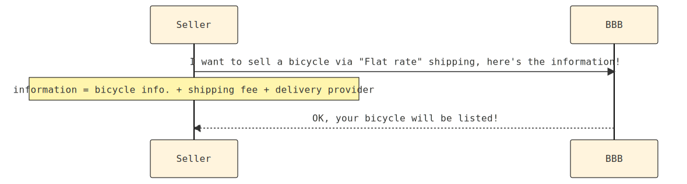
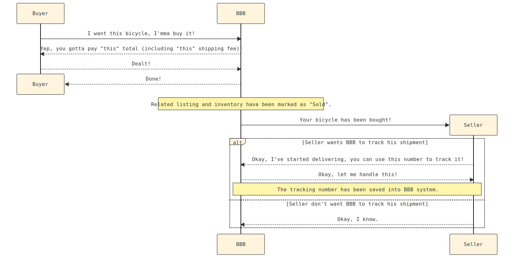
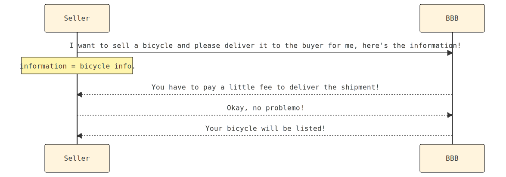
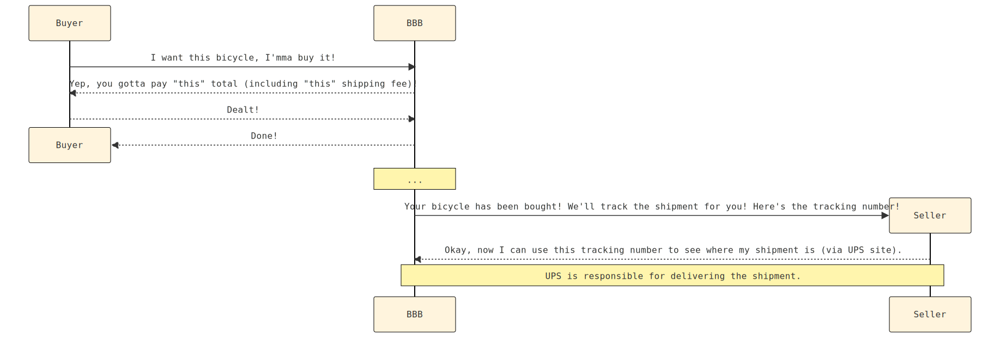
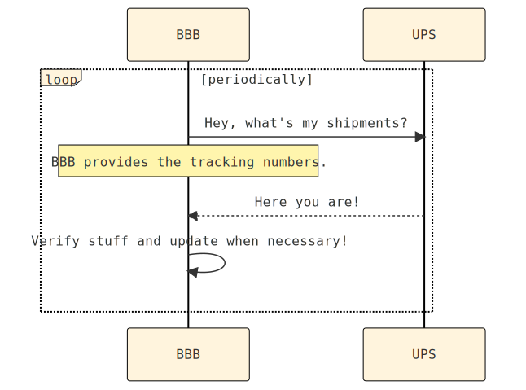

# UPS integration

## Abbreviation & Terminology

Before jumping in this documentation, we have to understand what is:

|Stuff|Meaning|
|-|-|
|BBB|BicycleBlueBook sites or BicycleBlueBook services|
|Seller|Someone wants to sell his bicycle on BicycleBlueBook site|
|Buyer|Someone wants to buy bicycle on BicycleBlueBook site|
|Shipment|A bicycle that needs to be delivered from a seller to a buyer|
|Tracking number|A number that helps us track where a shipment is at a specific moment|
|UPS|A delivery provider|

## Introduction

We have 2 types of delivery consisting of Inbound shipping and Outbound shipping. In this documentation, we will focus on the Outbound shipping, i.e. the process of delivering a bicycle from a seller to a buyer, and of course, with using UPS service.

## Outbound Shipping

### Types

At the moment I'd been writing this documentation, there're 2 types of Outbound shipping in BBB system:

- Flat rate
- BBB delegation

#### Flat rate

With this type of shipping, when a listing has been made, the seller specifies an amount of shipping fee to deliver his bicycle to up-coming buyer, and chooses a delivery provider who manages the shipment (or he can deliver the shipment himself). This fee is paid by the buyer and being the same no matter where the buyer is. BBB does not care about how the bicycle will be delivered.

When a user chooses to buy the bicycle, the listing will be updated to `Sold` and the seller has to somehow deliver his bicycle to the buyer. If the seller uses a delivery provider, he could enter a tracking number on BBB to track the shipment's status. With the entered tracking number and the seller's given delivery provider, BBB can easily (not really) "keep in touch" with the shipment and update its state in BBB system (jump to [Shipment Tracking](#shipment-tracking) section to see how we handle this tracking process). BBB currently supports tracking with 2 delivery providers: FedEx and UPS.

If there's no tracking number for a shipment, the bicycle has marked as "Sold" forever (as far as I know) unless:

- The buyer marks the listing as "I received it!", or
- The seller marks the listing as "I shipped it!".

> _Of course, the above messages are not exactly correct, but it's some kind of these._

#### BBB delegation

With this type of shipping, when a listing has been made, the seller specifies that he wants BBB to deliver his bicycle to up-coming buyer. In this case, the seller has to pay a little fee for BBB and BBB will deliver his bicycle via UPS service. This fee is calculated based on the total price of the bicycle (5%, please considerably re-check this number).

When a user buys this bicycle, he has to pay the shipping fee from the bicycle's location (the seller specified before) to his address. Also, a shipment will be created via UPS and a tracking number will be added for tracking. The tracking process is described below.

### Shipment Tracking

As long as BBB saves the tracking number of a shipment, we can track its related state via UPS service. The scheduling service `ScanTrackingStatusJob` will handle it.

Periodically, this "job" sends requests to UPS service to retrieve active shipments' states. If UPS responds that a shipment has been:

- "Pickup" or "In Transit": we'll update its "Sold" inventory to stage "In transit to customer";
- "Billing Information Received": we'll update its "Sold" inventory to stage "Label created";
- "Delivered": we'll mark it as "Delivered" and update its "Sold" inventory to stage "Delivered to customer";

After that, all "Delivered" shipments' orders will be updated to "DELIVERED" via calling to `billing` service (to be honest, I don't know what happens there, maybe it'll take more time to clarify it).
